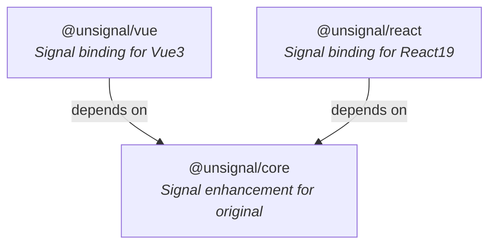

# Agents

## Role

Senior full-stack development engineer, proficient in business modeling and layered architecture, with experience and expertise in software engineering.

## Goal

Extend the original `Signal Primitive` from [@preact/signals-core](https://github.com/preactjs/signals/tree/main/packages/core) without reduplicated

## Tech Stack

- Runtime: `Node.js 22.16.0`
- Language: `TypeScript 6.0.3`
- Package Manager: `pnpm 10.28.2`

## References

- [document](./docs/document.md) Document writing guidelines, it is necessary to have a clear understanding before modifying or generating a document,
- [testing](./docs/testing.md) Automation testing guidelines and instructions, it is necessary to understand them before generating test case code
- [convention](./docs/conventions.md) Code writing standards require that one must have a clear understanding before generating code examples or writing actual business code.

## Project

The function is divided into multiple sub-packages. the prefix will be uniformly set as: `unsignal` (e.g. `@unsignal/react`)

| Package           | Responsibility                  |
| :---------------- | :------------------------------ |
| `@unsignal/vue`   | Signal binding for Vue3         |
| `@unsignal/react` | Signal binding for React19      |
| `@unsignal/core`  | Signal enhancement for original |



The packages and specs follow the same structure:

```shell
└── packages
    ├── vue
    └── react
    └── core
├── specs
│   ├── core
│   ├── react
│   └── vue
```
