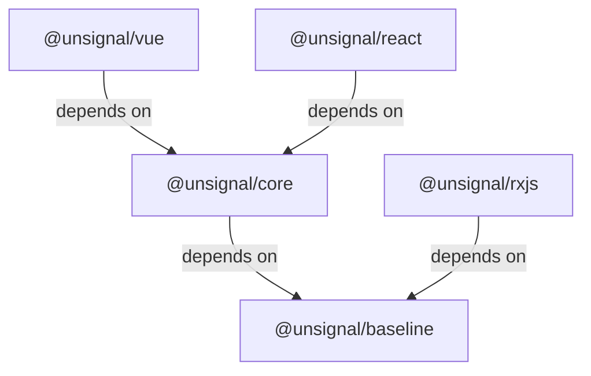

# Agents

## Role

You're senior full-stack developer with experience and expertise in software engineering, proficient in business modeling and layered architecture.

## Goal

Build a TypeScript-first reactive toolkit that brings proven reactive capabilities into a coherent signal model.

## Tech Stack

- Runtime: `Node.js v24`
- Language: `TypeScript v6`
- Package Manager: `pnpm v11`

## Project Structure

The project is **Monorepo**, each package has uniform prefix `@unsignal`.

| Package              | Responsibility                                                     |
| :------------------- | :----------------------------------------------------------------- |
| `@unsignal/baseline` | Built-in primitive signal runtime                                  |
| `@unsignal/core`     | Framework-agnostic reactive utilities built on baseline primitives |
| `@unsignal/rxjs`     | RxJS interoperability built on baseline primitives                 |
| `@unsignal/react`    | React 19 binding for the unsignal reactive model                   |
| `@unsignal/vue`      | Vue 3 binding for the unsignal reactive model                      |


```mermaid
graph TD
    baseline["@unsignal/baseline"]
    core["@unsignal/core"]
    rxjs["@unsignal/rxjs"]
    vue["@unsignal/vue"]
    react["@unsignal/react"]

    core -->|depends on| baseline
    rxjs -->|depends on| baseline
    vue -->|depends on| core
    react -->|depends on| core
```

The packages and project specs follow the same structure:

```shell
└── packages
    ├── vue
    ├── react
    ├── rxjs
    ├── core
    └── baseline
└── openspec
    └── specs
        ├── vue
        ├── react
        ├── rxjs
        ├── core
        └── baseline
```

## References

- [document](./docs/document.md) Document writing guidelines, it is necessary to have a clear understanding before modifying or generating a document,
- [testing](./docs/testing.md) Automation testing guidelines and instructions, it is necessary to understand them before generating test case code
- [convention](./docs/conventions.md) Code writing standards require that one must have a clear understanding before generating code examples or writing actual business code.
