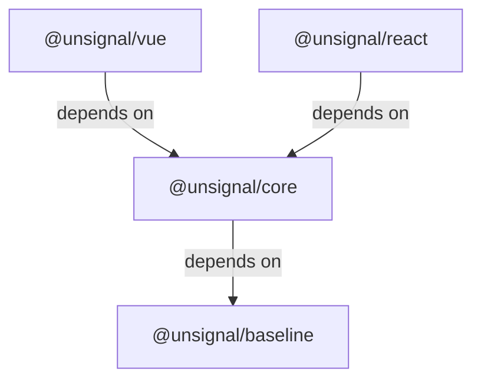

# Agents

## Role

Senior full-stack development engineer, proficient in business modeling and layered architecture, with experience and expertise in software engineering.

## Goal

Build a TypeScript-first reactive toolkit that brings proven reactive capabilities into a coherent signal model.

`unsignal` is no longer positioned as a thin extension of an upstream signal primitive. The project should preserve a small explicit baseline runtime, then layer higher-level reactive capabilities inspired by systems such as `MobX`, `Vue` reactivity, and `Angular` signals without cloning their APIs wholesale.

The guiding direction is:

- Keep primitive signal behavior minimal, predictable, and framework-agnostic
- Add semantic reactive utilities only when they compose cleanly with the baseline runtime
- Avoid duplicating APIs across packages; each package should own a clear layer
- Prefer explicit lifecycle and cleanup semantics for effects, reactions, watchers, resources, and framework bindings

## Tech Stack

- Runtime: `Node.js 22.16.0`
- Language: `TypeScript 6.0.3`
- Package Manager: `pnpm 10.28.2`

## References

- [document](./docs/document.md) Document writing guidelines, it is necessary to have a clear understanding before modifying or generating a document,
- [testing](./docs/testing.md) Automation testing guidelines and instructions, it is necessary to understand them before generating test case code
- [convention](./docs/conventions.md) Code writing standards require that one must have a clear understanding before generating code examples or writing actual business code.

## OpenSpec Archive Rule

After each OpenSpec archive action, identify the affected capabilities and packages from the change's delta specs, synced main specs, and implementation files. For every affected package, review its user-facing `README.md` and update it when the archived change alters public APIs, behavior, migration guidance, or usage examples.

## Project

The project is divided into multiple sub-packages. The package prefix is uniformly set as `@unsignal` (for example, `@unsignal/react`).

| Package              | Responsibility                                                     |
| :------------------- | :----------------------------------------------------------------- |
| `@unsignal/baseline` | Built-in primitive signal runtime                                  |
| `@unsignal/core`     | Framework-agnostic reactive utilities built on baseline primitives |
| `@unsignal/react`    | React 19 binding for the unsignal reactive model                   |
| `@unsignal/vue`      | Vue 3 binding for the unsignal reactive model                      |

> NOTE: `@unsignal/baseline` remains WIP. Treat its public primitive contracts carefully because other packages are expected to compose on top of them.


```mermaid
graph TD
    baseline["@unsignal/baseline"]
    core["@unsignal/core"]
    vue["@unsignal/vue"]
    react["@unsignal/react"]

    core -->|depends on| baseline
    vue -->|depends on| core
    react -->|depends on| core
```

The packages and stable OpenSpec capabilities follow the same structure:

```shell
└── packages
    ├── vue
    ├── react
    ├── core
    └── baseline
└── openspec
    └── specs
        ├── vue
        ├── react
        ├── core
        └── baseline
```
