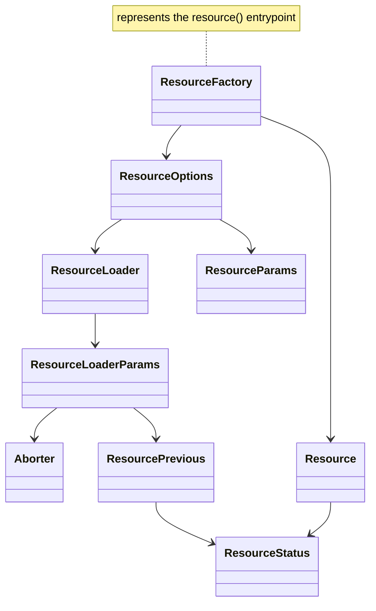
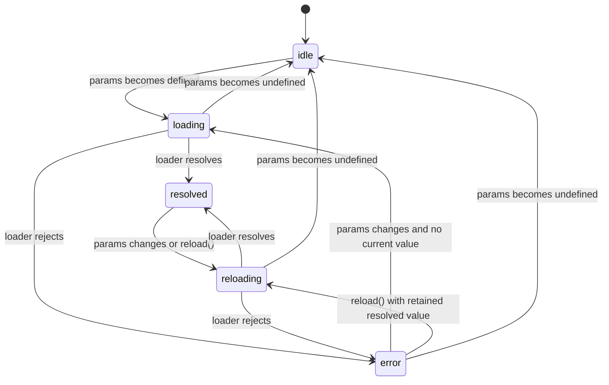

# @unsignal/core

## Business Objective

Extend the `@preact/signals-core` API

## Business Requirements

- Framework-agnostic, core reactive utility functions
- Complete `TypeScript` type declarations

## Business Design

### Design Principles

- Functionality complements `@preact/signals-core`, without duplicating its existing APIs (`signal` / `effect` / `computed`, etc.)
- Only use `@preact/signals-core` public APIs (`signal` / `computed` / `effect` / `batch` / `untracked` / `peek` / `createModel`), **usage of non-public methods is strictly prohibited!**

### Types

#### `DisposerFn`

Function type that stops reactive tracking and cleans up side effects

```ts
type DisposerFn = () => void;
```

#### `OnCleanup`

Utility type for registering cleanup functions, used for cleaning up side effects such as async tasks

```ts
type OnCleanup = (cleanupFn: () => void) => void;
```

#### `ReadonlyModel`

Utility type that transforms all `Signal<T>` properties in a `Model<TModel>` into `ReadonlySignal<T>`, recursively, while preserving methods and `ReadonlySignal` properties. The disposal contract is inherited from the original `Model<TModel>` type.

```ts
type ReadonlyModelFields<TModel> = {
  [Key in keyof TModel]: TModel[Key] extends ReadonlySignal<unknown>
    ? TModel[Key]
    : TModel[Key] extends Signal<infer U>
      ? ReadonlySignal<U>
      : TModel[Key] extends (...args: any[]) => any
        ? TModel[Key]
        : TModel[Key] extends object
          ? ReadonlyModel<TModel[Key]>
          : TModel[Key];
};

type ReadonlyModel<TModel> = Omit<Model<TModel>, keyof TModel> & ReadonlyModelFields<TModel>;
```

### API Reference

#### `reaction`

```ts
function reaction(fn: () => void, callback: () => void): DisposerFn;
```

**Behavior:**

- The `fn` parameter behaves exactly the same as `effect(fn)`: executes immediately, automatically tracks `signal` dependencies read inside, and re-executes when dependencies change
- The `callback` parameter: only called when `fn` re-executes due to dependency changes, **not triggered on initial execution**, and **the callback function does not trigger dependency tracking**
- Returns `DisposerFn`, see type declaration for semantics

**Usage Example: Track `signal` changes and execute callback**

```ts
import { signal } from '@preact/signals-core';
import { reaction } from '@unsignal/core';

const count = signal(0);

const dispose = reaction(
  () => {
    console.log('count is:', count.value);
  },
  () => {
    console.log('count changed!');
  }
);

// Initial execution: only outputs "count is: 0", callback not triggered
count.value = 1;
// Outputs "count is: 1"
// Outputs "count changed!"

count.value = 2;
// Outputs "count is: 2"
// Outputs "count changed!"

dispose();
count.value = 3;
// No output, tracking has been stopped
```

#### `readonly`

```ts
function readonly<T>(source: Signal<T>): ReadonlySignal<T>;
function readonly<T>(source: ReadonlySignal<T>): ReadonlySignal<T>;
```

**Behavior:**

- The `source` parameter: a `Signal<T>` or `ReadonlySignal<T>` instance
- Returns a new `ReadonlySignal<T>` created via reactive derivation from `source.value`
- When `source` is already a `ReadonlySignal<T>`, the returned value still mirrors `source`, but it is a new derived wrapper rather than the original instance
- The returned `ReadonlySignal` automatically stays in sync with `source` via reactive tracking

**Usage Example: Expose a signal as read-only**

```ts
import { signal } from '@preact/signals-core';
import { readonly } from '@unsignal/core';

const count = signal(0);
const ro = readonly(count);

console.log(ro.value); // 0

count.value = 1;
console.log(ro.value); // 1

// ro.value = 2; // Type error: cannot assign to a readonly signal
```

**Usage Example: Wrap an existing `ReadonlySignal`**

```ts
import { signal, computed } from '@preact/signals-core';
import { readonly } from '@unsignal/core';

const count = signal(0);
const doubled = computed(() => count.value * 2);

const ro = readonly(doubled);
// ro !== doubled, but always mirrors doubled.value
```

#### `createReadonlyModel`

```ts
type ReadonlyModelConstructor<TModel, TFactoryArgs extends any[] = []> = new (
  ...args: TFactoryArgs
) => ReadonlyModel<TModel>;

function createReadonlyModel<TModel, TFactoryArgs extends any[] = []>(
  modelFactory: ModelFactory<TModel, TFactoryArgs>
): ReadonlyModelConstructor<TModel, TFactoryArgs>;
```

**Motivation:**

In OO-style state management (like MobX), reactive properties are exposed directly on the model for view binding. This creates a problem — external code can mutate them at any time, bypassing the model's methods:

```ts
// Problem: count is exposed for view binding, but also writable from anywhere
const CounterModel = createModel(() => {
  const count = signal(0);
  return {
    count,
    increment() {
      count.value++;
    },
  };
});

const counter = new CounterModel();
counter.count.value = 999; // Allowed — bypasses increment, breaks encapsulation
```

`createReadonlyModel` addresses this at the type level by exposing the model instance as `ReadonlyModel<TModel>`. This keeps the runtime behavior of `createModel`, while providing a readonly API surface to TypeScript consumers:

```ts
const counter = new CounterModel();
// counter.count.value = 999; // Type error
counter.increment(); // Intended mutation path in consuming code
```

**Behavior:**

- Same factory contract and runtime behavior as `createModel`
- Returns the original runtime model instance shape; signal properties are **not** wrapped or replaced at runtime
- Exposes a readonly API surface through `ReadonlyModel<TModel>` typing, so `Signal<T>` properties appear as `ReadonlySignal<T>` to TypeScript consumers
- This is a compile-time contract, not a runtime mutation seal

**Usage Example: Expose a readonly model surface to TypeScript**

```ts
import { signal, computed } from '@preact/signals-core';
import { createReadonlyModel } from '@unsignal/core';

const CounterModel = createReadonlyModel((initial = 0) => {
  const count = signal(initial);
  const doubled = computed(() => count.value * 2);

  return {
    count,
    doubled,
    increment() {
      count.value++;
    },
    reset() {
      count.value = initial;
    },
  };
});

const counter = new CounterModel(5);

console.log(counter.count.value); // 5 — readable
console.log(counter.doubled.value); // 10 — readable

// counter.count.value = 99; // Type error in TypeScript

counter.increment();
console.log(counter.count.value); // 6

counter.reset();
console.log(counter.count.value); // 5

counter[Symbol.dispose]();
```

#### `watchEffect`

```ts
function watchEffect(fn: (onCleanup: OnCleanup) => void): DisposerFn;
```

**Behavior:**

- The `fn` parameter: executes immediately, automatically tracks `signal` dependencies read inside, and re-executes when dependencies change
- The `onCleanup` parameter: registers a cleanup function that is called **before the next `fn` re-execution** and **when `DisposerFn` is called**, used for canceling stale async tasks and other side effects
- Returns `DisposerFn`, see type declaration for semantics

**Usage Example: Async task cleanup**

```ts
import { signal } from '@preact/signals-core';
import { watchEffect } from '@unsignal/core';

const userId = signal(1);

const dispose = watchEffect((onCleanup) => {
  const controller = new AbortController();

  fetch(`/api/users/${userId.value}`, { signal: controller.signal })
    .then((res) => res.json())
    .then((data) => {
      // Handle data
    });

  // Register cleanup: cancel request before next re-execution or on dispose
  onCleanup(() => controller.abort());
});

userId.value = 2;
// Previous request is aborted, new request is initiated

dispose();
// Current request is aborted
```

#### `watch`

```ts
function watch<T>(
  source: ReadonlySignal<T> | (() => T),
  callback: WatchCallback<T>,
  options?: WatchOptions
): DisposerFn;

type WatchCallback<T> = (value: T, oldValue: T, onCleanup: OnCleanup) => void;

interface WatchOptions {
  immediate?: boolean;
}
```

**Behavior:**

- The `source` parameter: the watch source, can be a `ReadonlySignal<T>` or a `getter` function returning `T`
- The `callback` parameter: called when the return value of `source` changes, receiving the new value `value`, old value `oldValue`, and the `onCleanup` registration function
- The `onCleanup` parameter: registers a cleanup function that is called **before the next `callback` re-execution** and **when `DisposerFn` is called**, used for canceling stale async tasks and other side effects
- Lazy execution by default: does not immediately call `callback` upon creation, only triggers after `source` changes
- Option `immediate: true`: immediately calls `callback` once with the current value as `value` upon creation, with `oldValue` as `undefined`
- Change detection is based on `Object.is` semantic comparison of `source` return values
- Returns `DisposerFn`, see type declaration for semantics

**Usage Example: Watch getter return value changes**

```ts
import { signal } from '@preact/signals-core';
import { watch } from '@unsignal/core';

const count = signal(0);

const dispose = watch(
  () => count.value,
  (value, oldValue) => {
    console.log(`count: ${oldValue} -> ${value}`);
  }
);

// Initial execution: no output (lazy)
count.value = 1;
// Outputs "count: 0 -> 1"

count.value = 2;
// Outputs "count: 1 -> 2"

dispose();
count.value = 3;
```

#### `resource`

The `Resource` API provides a framework-agnostic async resource primitive for `@unsignal/core` that integrates with `@preact/signals-core`.



##### `ResourceStatus`

```ts
type ResourceStatus = 'idle' | 'loading' | 'reloading' | 'resolved' | 'error';
```



- `loading` means there is no retained value for the current resource instance
- `reloading` means a new run is active while the previous resolved value stays readable
- `error` may coexist with a retained value from an older successful run; consumers must read `value` and `error` independently
- Each `params` reevaluation is the entry point for deciding whether to abort, reset, or start a new loader run
- `params` becoming `undefined` aborts any active run, clears `error`, transitions to `idle`, and restores `value` to `defaultValue` or `undefined`
- `params` becoming defined aborts any active run, clears `error`, and starts a new loader run
- A new run uses `loading` when no retained value exists and `reloading` when a retained value exists
- A resolved active run commits `value`, clears `error`, and transitions to `resolved`
- A rejected active run commits `error` and transitions to `error`
- Only the latest active loader run may commit; any stale resolve or reject result is ignored completely
- Loader authors do not need to branch on aborted state; stale-run protection is owned by the `Resource` implementation

##### `Aborter`

```ts
interface Aborter {
  readonly signal: AbortSignal;
  onAbort(cleanupFn: () => void): void;
}
```

**Annotations:**

- `Aborter` is designed for developers to recycle physical resources
- `Aborter` never throws; if `onAbort(cleanupFn)` is called after the run is already aborted, the callback is ignored
- Loader authors never need to inspect aborted state; if cleanup is omitted or implemented incorrectly, `Resource` state still remains correct, only the external resource cleanup is affected

##### `ResourcePrevious`

```ts
interface ResourcePrevious {
  readonly status: ResourceStatus;
}
```

##### `ResourceLoaderParams`

```ts
interface ResourceLoaderParams<TParams> {
  readonly params: TParams;
  readonly aborter: Aborter;
  readonly previous: ResourcePrevious;
}
```

##### `ResourceLoader`

```ts
type ResourceLoader<TParams, TValue> = (params: ResourceLoaderParams<TParams>) => Promise<TValue>;
```

##### `Resource`

```ts
interface Resource<T> {
  readonly value: ReadonlySignal<T>;
  readonly status: ReadonlySignal<ResourceStatus>;
  readonly error: ReadonlySignal<unknown | undefined>;
  readonly isLoading: ReadonlySignal<boolean>;
  hasValue(this: T extends undefined ? this : never): this is Resource<Exclude<T, undefined>>;
  hasValue(): boolean;
  reload(): boolean;
  destroy(): void;
}
```

##### `ResourceOptions`

```ts
type ResourceParams<TParams> = ReadonlySignal<TParams | undefined> | (() => TParams | undefined);

interface ResourceOptions<TParams, TValue> {
  params: ResourceParams<TParams>;
  loader: ResourceLoader<TParams, TValue>;
  defaultValue?: TValue;
}
```

- `defaultValue` establishes the initial retained value and is restored whenever `params` becomes `undefined`

##### `Resource Factory`

```ts
function resource<TParams, TValue>(
  options: ResourceOptions<TParams, TValue> & { defaultValue: NoInfer<TValue> }
): Resource<TValue>;

function resource<TParams, TValue>(
  options: ResourceOptions<TParams, TValue>
): Resource<TValue | undefined>;
```

- Construction performs an immediate `params` evaluation under reactive tracking
- A defined `params` value starts a loader run immediately
- An `undefined` `params` value keeps the resource in `idle`
- `params` is reactive:
  - when it is a `ReadonlySignal`, the resource tracks `params.value`
  - when it is a getter function, the resource tracks signal reads inside the getter
- `value` is the single source of truth for whether a resource currently holds a value
- When `params` becomes `undefined`:
  - abort any running loader
  - clear `error`
  - set `status` to `idle`
  - set `value` to `defaultValue` when provided, otherwise `undefined`
- When `params` becomes defined:
  - abort any running loader
  - start a new loader run
  - use `loading` if there is no currently retained value
  - use `reloading` if a current value is retained
- `reload()`:
  - reruns the loader using the latest defined `params`
  - returns `false` when current `params` is `undefined`
  - otherwise aborts the current run, starts a new run, and returns `true`
- `destroy()`:
  - stops reactive tracking
  - aborts any running loader

**Usage Example**

```ts
import { signal } from '@preact/signals-core';
import { resource } from '@unsignal/core';

interface User {
  id: number;
  name: string;
}

const userId = signal<number | undefined>(1);

const userResource = resource({
  params: () => userId.value,
  loader: async ({ params, aborter }) => {
    const response = await fetch(`/api/users/${params}`, {
      signal: aborter.signal,
    });
    const user: User = await response.json();

    return user;
  },
});
```

**Usage Example: Legacy Cancellation**

```ts
import { signal } from '@preact/signals-core';
import { resource } from '@unsignal/core';

const query = signal<string | undefined>('hello');

const searchResource = resource({
  params: () => query.value?.trim(),
  defaultValue: [] as string[],
  loader: ({ params, aborter }) =>
    new Promise<string[]>((resolve) => {
      const timer = setTimeout(() => {
        resolve([params]);
      }, 300);

      aborter.onAbort(() => clearTimeout(timer));
    }),
});
```
