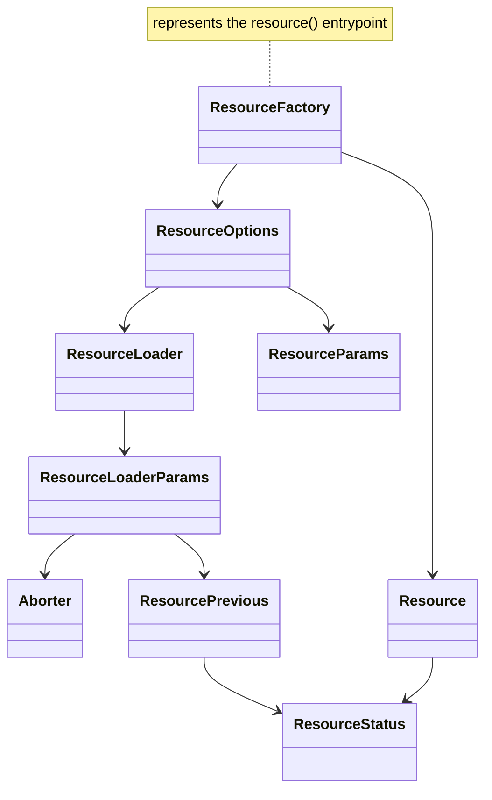
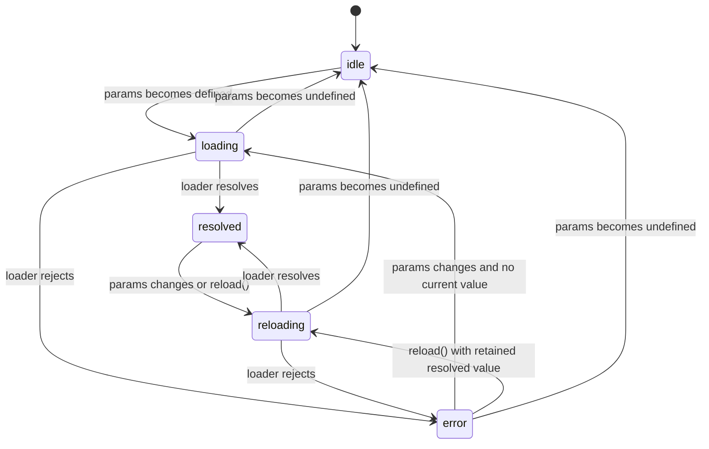

# @unsignal/core

## Business Objective

Provide framework-agnostic reactive utilities that compose with `@unsignal/baseline`.

## Business Requirements

- Framework-agnostic, core reactive utility functions
- Complete `TypeScript` type declarations

## Business Design

### Design Principles

- Functionality complements `@unsignal/baseline`, without duplicating its existing APIs (`signal` / `effect` / `computed`, etc.)
- Only use `@unsignal/baseline` public APIs (`signal` / `computed` / `effect` / `batch` / `untracked` / `peek`), **usage of non-public methods is strictly prohibited!**

### Types

#### `Disposable`

Resource-oriented handle type that stops reactive tracking and cleans up side effects

```ts
import type { Disposable } from '@unsignal/baseline';
```

#### `OnCleanup`

Utility type for registering cleanup functions, used for cleaning up side effects such as async tasks

```ts
type OnCleanup = (cleanupFn: () => void) => void;
```

### API Reference

#### `reaction`

```ts
function reaction(fn: () => void, callback: () => void): Disposable;
```

**Behavior:**

- The `fn` parameter behaves exactly the same as `effect(fn)`: executes immediately, automatically tracks `signal` dependencies read inside, and re-executes when dependencies change
- The `callback` parameter: only called when `fn` re-executes due to dependency changes, **not triggered on initial execution**, and **the callback function does not trigger dependency tracking**
- Returns `Disposable`, using the same resource-oriented disposal semantics as `@unsignal/baseline` `effect()`

**Usage Example: Track `signal` changes and execute callback**

```ts
import { signal } from '@unsignal/baseline';
import { reaction } from '@unsignal/core';

const count = signal(0);

const dispose = reaction(
  () => {
    console.log('count is:', count.value);
  },
  () => {
    console.log('count changed!');
  }
);

// Initial execution: only outputs "count is: 0", callback not triggered
count.value = 1;
// Outputs "count is: 1"
// Outputs "count changed!"

count.value = 2;
// Outputs "count is: 2"
// Outputs "count changed!"

dispose();
count.value = 3;
// No output, tracking has been stopped
```

#### `readonly`

```ts
function readonly<T>(source: Signal<T>): ReadonlySignal<T>;
function readonly<T>(source: ReadonlySignal<T>): ReadonlySignal<T>;
```

**Behavior:**

- The `source` parameter: a `Signal<T>` or `ReadonlySignal<T>` instance
- Returns a new `ReadonlySignal<T>` created via reactive derivation from `source.value`
- When `source` is already a `ReadonlySignal<T>`, the returned value still mirrors `source`, but it is a new derived wrapper rather than the original instance
- The returned `ReadonlySignal` automatically stays in sync with `source` via reactive tracking

**Usage Example: Expose a signal as read-only**

```ts
import { signal } from '@unsignal/baseline';
import { readonly } from '@unsignal/core';

const count = signal(0);
const ro = readonly(count);

console.log(ro.value); // 0

count.value = 1;
console.log(ro.value); // 1

// ro.value = 2; // Type error: cannot assign to a readonly signal
```

**Usage Example: Wrap an existing `ReadonlySignal`**

```ts
import { signal, computed } from '@unsignal/baseline';
import { readonly } from '@unsignal/core';

const count = signal(0);
const doubled = computed(() => count.value * 2);

const ro = readonly(doubled);
// ro !== doubled, but always mirrors doubled.value
```

#### `watchEffect`

```ts
function watchEffect(fn: (onCleanup: OnCleanup) => void): Disposable;
```

**Behavior:**

- The `fn` parameter: executes immediately, automatically tracks `signal` dependencies read inside, and re-executes when dependencies change
- The `onCleanup` parameter: registers a cleanup function that is called **before the next `fn` re-execution** and **when the returned `Disposable` is disposed**, used for canceling stale async tasks and other side effects
- Returns `Disposable`, using the same resource-oriented disposal semantics as `@unsignal/baseline` `effect()`

**Usage Example: Async task cleanup**

```ts
import { signal } from '@unsignal/baseline';
import { watchEffect } from '@unsignal/core';

const userId = signal(1);

const dispose = watchEffect((onCleanup) => {
  const controller = new AbortController();

  fetch(`/api/users/${userId.value}`, { signal: controller.signal })
    .then((res) => res.json())
    .then((data) => {
      // Handle data
    });

  // Register cleanup: cancel request before next re-execution or on dispose
  onCleanup(() => controller.abort());
});

userId.value = 2;
// Previous request is aborted, new request is initiated

dispose();
// Current request is aborted
```

#### `watch`

```ts
function watch<T>(
  source: ReadonlySignal<T> | (() => T),
  callback: WatchCallback<T>,
  options?: WatchOptions
): Disposable;

type WatchCallback<T> = (value: T, oldValue: T, onCleanup: OnCleanup) => void;

interface WatchOptions {
  immediate?: boolean;
}
```

**Behavior:**

- The `source` parameter: the watch source, can be a `ReadonlySignal<T>` or a `getter` function returning `T`
- The `callback` parameter: called when the return value of `source` changes, receiving the new value `value`, old value `oldValue`, and the `onCleanup` registration function
- The `onCleanup` parameter: registers a cleanup function that is called **before the next `callback` re-execution** and **when the returned `Disposable` is disposed**, used for canceling stale async tasks and other side effects
- Lazy execution by default: does not immediately call `callback` upon creation, only triggers after `source` changes
- Option `immediate: true`: immediately calls `callback` once with the current value as `value` upon creation, with `oldValue` as `undefined`
- Change detection is based on `Object.is` semantic comparison of `source` return values
- Returns `Disposable`, using the same resource-oriented disposal semantics as `@unsignal/baseline` `effect()`

**Usage Example: Watch getter return value changes**

```ts
import { signal } from '@unsignal/baseline';
import { watch } from '@unsignal/core';

const count = signal(0);

const dispose = watch(
  () => count.value,
  (value, oldValue) => {
    console.log(`count: ${oldValue} -> ${value}`);
  }
);

// Initial execution: no output (lazy)
count.value = 1;
// Outputs "count: 0 -> 1"

count.value = 2;
// Outputs "count: 1 -> 2"

dispose();
count.value = 3;
```

#### `resource`

The `Resource` API provides a framework-agnostic async resource primitive for `@unsignal/core` that integrates with `@unsignal/baseline`.


```mermaid
classDiagram
    class ResourceStatus
    class Aborter
    class ResourcePrevious
    class ResourceLoaderParams
    class ResourceLoader
    class Resource
    class ResourceOptions
    class ResourceParams
    class ResourceFactory

    ResourcePrevious --> ResourceStatus
    ResourceLoaderParams --> Aborter
    ResourceLoaderParams --> ResourcePrevious
    ResourceLoader --> ResourceLoaderParams
    Resource --> ResourceStatus
    ResourceOptions --> ResourceParams
    ResourceOptions --> ResourceLoader
    ResourceFactory --> ResourceOptions
    ResourceFactory --> Resource

    note for ResourceFactory "represents the resource() entrypoint"
```

##### `ResourceStatus`

```ts
type ResourceStatus = 'idle' | 'loading' | 'reloading' | 'resolved' | 'error';
```


```mermaid
stateDiagram-v2
    [*] --> idle
    idle --> loading: params becomes defined
    loading --> resolved: loader resolves
    loading --> error: loader rejects
    loading --> idle: params becomes undefined
    resolved --> reloading: params changes or reload()
    reloading --> resolved: loader resolves
    reloading --> error: loader rejects
    reloading --> idle: params becomes undefined
    error --> loading: params changes and no current value
    error --> reloading: reload() with retained resolved value
    error --> idle: params becomes undefined
```

- `loading` means there is no retained value for the current resource instance
- `reloading` means a new run is active while the previous resolved value stays readable
- `error` may coexist with a retained value from an older successful run; consumers must read `value` and `error` independently
- Each `params` reevaluation is the entry point for deciding whether to abort, reset, or start a new loader run
- `params` becoming `undefined` aborts any active run, clears `error`, transitions to `idle`, and restores `value` to `defaultValue` or `undefined`
- `params` becoming defined aborts any active run, clears `error`, and starts a new loader run
- A new run uses `loading` when no retained value exists and `reloading` when a retained value exists
- A resolved active run commits `value`, clears `error`, and transitions to `resolved`
- A rejected active run commits `error` and transitions to `error`
- Only the latest active loader run may commit; any stale resolve or reject result is ignored completely
- Loader authors do not need to branch on aborted state; stale-run protection is owned by the `Resource` implementation

##### `Aborter`

```ts
interface Aborter {
  readonly signal: AbortSignal;
  onAbort(cleanupFn: () => void): void;
}
```

**Annotations:**

- `Aborter` is designed for developers to recycle physical resources
- `Aborter` never throws; if `onAbort(cleanupFn)` is called after the run is already aborted, the callback is ignored
- Loader authors never need to inspect aborted state; if cleanup is omitted or implemented incorrectly, `Resource` state still remains correct, only the external resource cleanup is affected

##### `ResourcePrevious`

```ts
interface ResourcePrevious {
  readonly status: ResourceStatus;
}
```

##### `ResourceLoaderParams`

```ts
interface ResourceLoaderParams<TParams> {
  readonly params: TParams;
  readonly aborter: Aborter;
  readonly previous: ResourcePrevious;
}
```

##### `ResourceLoader`

```ts
type ResourceLoader<TParams, TValue> = (params: ResourceLoaderParams<TParams>) => Promise<TValue>;
```

##### `Resource`

```ts
interface Resource<T> {
  readonly value: ReadonlySignal<T>;
  readonly status: ReadonlySignal<ResourceStatus>;
  readonly error: ReadonlySignal<unknown | undefined>;
  readonly isLoading: ReadonlySignal<boolean>;
  hasValue(this: T extends undefined ? this : never): this is Resource<Exclude<T, undefined>>;
  hasValue(): boolean;
  reload(): boolean;
  destroy(): void;
}
```

##### `ResourceOptions`

```ts
type ResourceParams<TParams> = ReadonlySignal<TParams | undefined> | (() => TParams | undefined);

interface ResourceOptions<TParams, TValue> {
  params: ResourceParams<TParams>;
  loader: ResourceLoader<TParams, TValue>;
  defaultValue?: TValue;
}
```

- `defaultValue` establishes the initial retained value and is restored whenever `params` becomes `undefined`

##### `Resource Factory`

```ts
function resource<TParams, TValue>(
  options: ResourceOptions<TParams, TValue> & { defaultValue: NoInfer<TValue> }
): Resource<TValue>;

function resource<TParams, TValue>(
  options: ResourceOptions<TParams, TValue>
): Resource<TValue | undefined>;
```

- Construction performs an immediate `params` evaluation under reactive tracking
- A defined `params` value starts a loader run immediately
- An `undefined` `params` value keeps the resource in `idle`
- `params` is reactive:
  - when it is a `ReadonlySignal`, the resource tracks `params.value`
  - when it is a getter function, the resource tracks signal reads inside the getter
- `value` is the single source of truth for whether a resource currently holds a value
- When `params` becomes `undefined`:
  - abort any running loader
  - clear `error`
  - set `status` to `idle`
  - set `value` to `defaultValue` when provided, otherwise `undefined`
- When `params` becomes defined:
  - abort any running loader
  - start a new loader run
  - use `loading` if there is no currently retained value
  - use `reloading` if a current value is retained
- `reload()`:
  - reruns the loader using the latest defined `params`
  - returns `false` when current `params` is `undefined`
  - otherwise aborts the current run, starts a new run, and returns `true`
- `destroy()`:
  - stops reactive tracking
  - aborts any running loader

**Usage Example**

```ts
import { signal } from '@unsignal/baseline';
import { resource } from '@unsignal/core';

interface User {
  id: number;
  name: string;
}

const userId = signal<number | undefined>(1);

const userResource = resource({
  params: () => userId.value,
  loader: async ({ params, aborter }) => {
    const response = await fetch(`/api/users/${params}`, {
      signal: aborter.signal,
    });
    const user: User = await response.json();

    return user;
  },
});
```

**Usage Example: Legacy Cancellation**

```ts
import { signal } from '@unsignal/baseline';
import { resource } from '@unsignal/core';

const query = signal<string | undefined>('hello');

const searchResource = resource({
  params: () => query.value?.trim(),
  defaultValue: [] as string[],
  loader: ({ params, aborter }) =>
    new Promise<string[]>((resolve) => {
      const timer = setTimeout(() => {
        resolve([params]);
      }, 300);

      aborter.onAbort(() => clearTimeout(timer));
    }),
});
```

## Canonical Requirements

### Requirement: Core utilities target baseline primitives

`@unsignal/core` SHALL define its public signal utility APIs against `@unsignal/baseline` primitives.

#### Scenario: Core APIs accept writable and readonly baseline signals

- **WHEN** a consumer calls `readonly`, `watch`, `watchEffect`, `reaction`, or `resource`
- **THEN** the documented types, examples, and supported runtime behavior MUST target `Signal`, `ReadonlySignal`, `effect`, `computed`, `batch`, and `untracked` from `@unsignal/baseline`

#### Scenario: Core documentation describes baseline as the primitive dependency

- **WHEN** a consumer reads the package documentation or installation guidance for `@unsignal/core`
- **THEN** the package MUST describe `@unsignal/baseline` as the supported primitive dependency

### Requirement: Core excludes baseline-incompatible model helpers

`@unsignal/core` SHALL NOT expose model-constructor helpers that depend on primitive APIs absent from `@unsignal/baseline`.

#### Scenario: Model helpers are no longer part of the core contract

- **WHEN** a consumer imports from `@unsignal/core`
- **THEN** the package MUST NOT export `createReadonlyModel`, `ReadonlyModel`, or model-constructor types that depend on `createModel`

#### Scenario: Migration guidance points to direct baseline composition

- **WHEN** a consumer migrates away from removed model-helper APIs
- **THEN** the package guidance MUST direct them to explicit classes, factory functions, or plain objects composed from baseline `signal`, `computed`, and `readonly` primitives

### Requirement: Core exposes MobX decorator subpath

`@unsignal/core` SHALL expose a separate `@unsignal/core/mobx` subpath for MobX-flavored decorators without adding those decorators to the root `@unsignal/core` export.

#### Scenario: Import decorators from subpath

- **WHEN** a consumer imports MobX-flavored decorators from `@unsignal/core/mobx`
- **THEN** the package resolves runtime code and TypeScript declarations for that subpath

#### Scenario: Export subpath uses compiled files

- **WHEN** the package export map declares `@unsignal/core/mobx`
- **THEN** its runtime and type declaration targets point to compiled files under `dist` rather than source files

#### Scenario: Root export remains unchanged

- **WHEN** a consumer imports from `@unsignal/core`
- **THEN** the MobX-flavored decorators are not part of the root export surface

### Requirement: Core build compiles multiple entry points

`@unsignal/core` SHALL configure its `tsdown` build with explicit entries for both the root API and the MobX decorator subpath.

#### Scenario: Build emits root entry

- **WHEN** the core package build completes
- **THEN** compiled runtime and type declaration files exist for the root `@unsignal/core` entry

#### Scenario: Build emits MobX entry

- **WHEN** the core package build completes
- **THEN** compiled runtime and type declaration files exist for the `@unsignal/core/mobx` entry

### Requirement: Observable accessor decorator hides signal storage

The MobX flavor SHALL provide an `observable` decorator for 2022 Stage 3 class accessors that stores each instance value in reactive signal-backed state while exposing normal property reads and writes.

#### Scenario: Read initialized observable accessor

- **WHEN** a class instance reads an `@observable accessor` initialized with a value
- **THEN** the read returns the initialized value rather than a signal object

#### Scenario: Write observable accessor

- **WHEN** a class instance assigns a new value to an `@observable accessor`
- **THEN** subsequent reads return the assigned value and reactive dependents are notified

#### Scenario: Keep instance state isolated

- **WHEN** two instances of the same decorated class use the same `@observable accessor`
- **THEN** writes on one instance do not change the value observed on the other instance

### Requirement: Computed getter decorator exposes derived values

The MobX flavor SHALL provide a `computed` decorator for 2022 Stage 3 class getters that exposes the getter result as a normal value backed by per-instance computed reactive state.

#### Scenario: Read computed getter

- **WHEN** a class instance reads an `@computed` getter that derives from observable accessors
- **THEN** the read returns the derived value rather than a readonly signal object

#### Scenario: Recompute after dependency change

- **WHEN** an observable accessor read by an `@computed` getter changes
- **THEN** subsequent reads of the computed getter return a value derived from the latest observable state

#### Scenario: Keep computed state isolated

- **WHEN** two instances of the same decorated class read the same `@computed` getter
- **THEN** each instance derives from its own observable state

### Requirement: Action method decorator batches mutations

The MobX flavor SHALL provide an `action` decorator for 2022 Stage 3 class methods that runs the original method as a baseline action while preserving the method receiver, arguments, and return value.

#### Scenario: Invoke action method

- **WHEN** a decorated action method is invoked with arguments
- **THEN** the original method receives the same `this` value and arguments and the caller receives the original return value

#### Scenario: Batch action writes

- **WHEN** a decorated action method performs multiple observable writes
- **THEN** reactive effects observe the resulting updates according to `@unsignal/baseline` action batching semantics

### Requirement: Bound action method decorator preserves instance binding

The MobX flavor SHALL provide `action.bound` for 2022 Stage 3 class methods that binds the decorated method to its instance while preserving baseline action behavior.

#### Scenario: Invoke extracted bound action method

- **WHEN** an `@action.bound` method is read from an instance and invoked without an explicit receiver
- **THEN** the original method still executes with `this` bound to that instance

#### Scenario: Bound action batches writes

- **WHEN** an `@action.bound` method performs multiple observable writes
- **THEN** reactive effects observe the resulting updates according to `@unsignal/baseline` action batching semantics

### Requirement: MobX flavor supports only 2022 Stage 3 decorators

The MobX flavor SHALL support only the 2022 Stage 3 decorator forms required for class accessors, getters, and methods.

#### Scenario: Use standard accessor syntax

- **WHEN** a consumer writes `@observable accessor value = initialValue`
- **THEN** the decorator is valid for the supported observable field API

#### Scenario: Exclude legacy property decorators

- **WHEN** a consumer attempts to use legacy property decorator syntax such as `@observable value = initialValue`
- **THEN** the API does not promise support for that form
