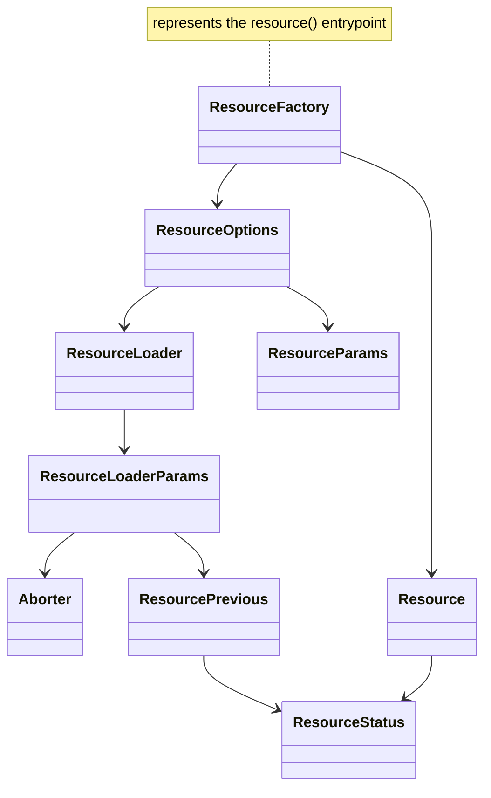
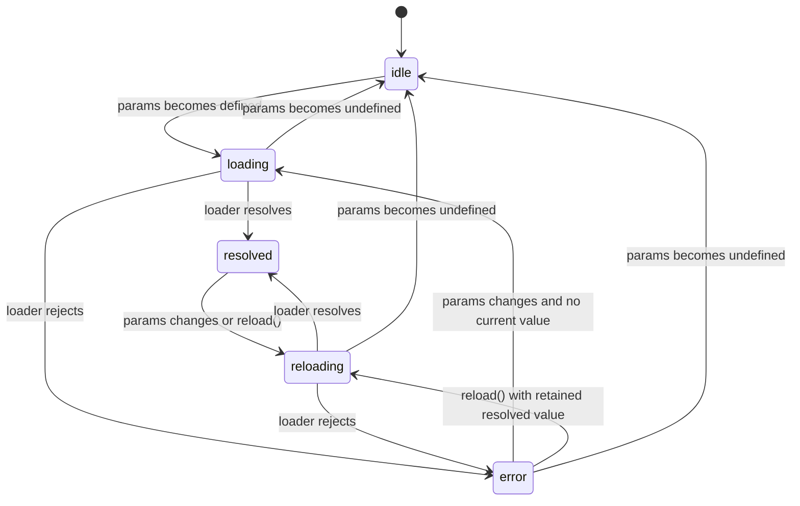

# @unsignal/core

## Goal

`@unsignal/core` defines the framework-agnostic reactive utility layer for the `unsignal` ecosystem, which provide clear, typed, lifecycle-aware utilities for common reactive patterns

## Principles

- Prefer explicit lifecycle handles over hidden global behavior.
- Prefer explicit cleanup, cancellation, and disposal without deep thinking.
- Prefer framework bindings agnostic and prohibit depending on browser or framework-specific behavior.

## Package Shape

The public surface is organized by intent:

- `@unsignal/core` contains general-purpose utilities that are broadly useful in any runtime.
- `@unsignal/core/mobx` contains MobX-flavored decorator conveniences.
- `@unsignal/core/resource` contains async resource state management.

## API Reference

### `Disposable`

The uniform resource-oriented handler across tge `unsignal` family to stop reactive tracking and cleans up side effects

```ts
import type { Disposable } from '@unsignal/baseline';
```

### `OnCleanup`

Utility type for registering cleanup functions, used for cleaning up side effects such as async tasks

```ts
type OnCleanup = (cleanupFn: () => void) => void;
```

### `reaction`

```ts
function reaction(fn: () => void, callback: () => void): Disposable;
```

**Behavior:**

- The `fn` parameter behaves exactly the same as `effect(fn)`: executes immediately, automatically tracks `signal` dependencies read inside, and re-executes when dependencies change
- The `callback` parameter: only called when `fn` re-executes due to dependency changes, **not triggered on initial execution**, and **the callback function does not trigger dependency tracking**

**Usage Example:**

```ts
import { signal } from '@unsignal/baseline';
import { reaction } from '@unsignal/core';

const count = signal(0);

const disposable = reaction(
  () => {
    console.log('count is:', count.value);
  },
  () => {
    console.log('count changed!');
  }
);

// Initial execution: only outputs "count is: 0", callback not triggered
count.value = 1;
// Outputs "total changed to: 1"

count.value = 2;
// Outputs "total changed to: 2"

// explicitly abort the reaction
disposable.dispose();

count.value = 3;
// No output, tracking has been stopped
```

### `readonly`

```ts
function readonly<T>(source: Signal<T>): ReadonlySignal<T>;
function readonly<T>(source: ReadonlySignal<T>): ReadonlySignal<T>;
```

**Behavior:**

- The `source` parameter: a `Signal<T>` or `ReadonlySignal<T>` instance
- When `source` is already a `ReadonlySignal<T>`, return the original instance
- When `source` is not a `ReadonlySignal<T>`, returns a new `ReadonlySignal<T>` created via reactive derivation from `source.value`

**Usage Example:**

```ts
import { signal } from '@unsignal/baseline';
import { readonly } from '@unsignal/core';

const count = signal(0);
const ro = readonly(count);

console.log(ro.value); // 0

count.value = 1;
console.log(ro.value); // 1

// ro.value = 2; // Type error: cannot assign to a readonly signal
```

**Usage Example:**

```ts
import { signal, computed } from '@unsignal/baseline';
import { readonly } from '@unsignal/core';

const count = signal(0);
const doubled = computed(() => count.value * 2);

// ro1 !== count
const ro1 = readonly(count);
// ro2 === doubled
const ro2 = readonly(doubled);
```

### `asReadonly`

```ts
function asReadonly<T>(value: T): ShallowReadonlySignals<T>;
function asReadonly<T>(value: T, options: { deep: true }): DeepReadonlySignals<T>;
```

**Behavior:**

- The `value` parameter may be a `Signal<T>`, `ReadonlySignal<T>`, `Object Literal`, or `Class Instance`
- Uses shallow projection by default, supports deep projection when `options.deep` is `true`
- Narrows signal-valued members to `ReadonlySignal` at the type level only, it doesn't create derived signal wrappers, freeze objects, or clone object graphs, it just returns the same runtime value that was passed in

**Usage Example:**

Expose a signal through a readonly type without wrapping

```ts
import { signal } from '@unsignal/baseline';
import { asReadonly } from '@unsignal/core';

const count = signal(0);
const ro = asReadonly(count);

console.log(ro === count); // true
console.log(ro.value); // 0
```

**Usage Example:**

Narrow signal-bearing members on an object

```ts
import { signal } from '@unsignal/baseline';
import { asReadonly } from '@unsignal/core';

const counter = {
  count: signal(0),
  nested: {
    total: signal(1),
  },
};

const shallowCounter = asReadonly(counter);
const deepCounter = asReadonly(counter, { deep: true });

// shallowCounter.count is readonly, nested.total keeps its original type
// deepCounter.nested.total is also readonly
```

### `watchEffect`

```ts
function watchEffect(fn: (onCleanup: OnCleanup) => void): Disposable;
```

**Behavior:**

- The `fn` parameter: executes immediately, automatically tracks `signal` dependencies read inside, and re-executes when dependencies change
- The `onCleanup` parameter: registers a cleanup function that is called **before the next fn re-execution** or **when the reaction is disposed**, used for canceling stale async tasks and other side effects

**Usage Example:**

```ts
import { signal } from '@unsignal/baseline';
import { watchEffect } from '@unsignal/core';

const userId = signal(1);

const disposable = watchEffect((onCleanup) => {
  const controller = new AbortController();

  fetch(`/api/users/${userId.value}`, { signal: controller.signal })
    .then((res) => res.json())
    .then((data) => {
      // Handle data
    });

  // Register cleanup: cancel request before next re-execution or on dispose
  onCleanup(() => controller.abort());
});

userId.value = 2;
// Previous request is aborted, new request is initiated

disposable.dispose();
// Current request is aborted
```

### `watch`

```ts
function watch<T>(
  source: ReadonlySignal<T> | (() => T),
  callback: WatchCallback<T>,
  options?: WatchOptions
): Disposable;

type WatchCallback<T> = (value: T, oldValue: T, onCleanup: OnCleanup) => void;

interface WatchOptions {
  immediate?: boolean;
}
```

**Behavior:**

- The `source` parameter: the watch source, can be a `ReadonlySignal<T>` or a `getter` function returning `T`
- The `callback` parameter: called when the return value of `source` changes, receiving the new value `value`, old value `oldValue`, and the `onCleanup` registration function
- The `onCleanup` parameter: registers a cleanup function that is called **before the next fn re-execution** or **when the reaction is disposed**, used for canceling stale async tasks and other side effects
- Lazy execution by default: does not immediately call `callback` upon creation, only triggers after `source` changes
- Option `immediate: true`: immediately calls `callback` once with the current value as `value` upon creation, with `oldValue` as `undefined`
- Change detection is based on `Object.is` semantic comparison of `source` return values

**Usage Example:**

```ts
import { signal } from '@unsignal/baseline';
import { watch } from '@unsignal/core';

const count = signal(0);

const disposable = watch(
  () => count.value,
  (value, oldValue) => {
    console.log(`count: ${oldValue} -> ${value}`);
  }
);

// Initial execution: no output (lazy)
count.value = 1;
// Outputs "count: 0 -> 1"

count.value = 2;
// Outputs "count: 1 -> 2"

disposable.dispose();
// Dispose the watch reaction

count.value = 3;
// No extra output!
```

### `@unsignal/core/mobx`

The `@unsignal/core/mobx` entrypoint provides MobX-flavored class decorator conveniences built on top of `@unsignal/baseline`.

```ts
import { action, computed, observable } from '@unsignal/core/mobx';
```

#### `observable`

**Behavior:**

- `observable` is a class `accessor` decorator for instance state
- Each decorated accessor owns a per-instance `Signal<TValue>` backing source
- `get` returns the current signal value and participates in reactive tracking
- `set` writes through the backing signal so downstream observers react to updates
- `init` seeds the backing signal with the accessor's initial value
- If an instance is read before initialization completes, the decorator lazily creates its backing signal from the original accessor getter

**Usage Example:**

```ts
import { observable } from '@unsignal/core/mobx';

class CounterStore {
  @observable accessor count = 0;
}

const store = new CounterStore();

console.log(store.count); // 0

store.count = 1;
console.log(store.count); // 1
```

#### `computed`

**Behavior:**

- `computed` is a class `getter` decorator for derived values
- Each decorated getter owns a per-instance cached `ReadonlySignal<TValue>`
- The computed source is created lazily on first read and then reused for that instance
- Reads inside the decorated getter are tracked reactively, and the cached value updates when those dependencies change

**Usage Example:**

```ts
import { computed, observable } from '@unsignal/core/mobx';

class CounterStore {
  @observable accessor count = 1;

  @computed
  get doubled() {
    return this.count * 2;
  }
}

const store = new CounterStore();

console.log(store.doubled); // 2

store.count = 2;
console.log(store.doubled); // 4
```

#### `action`

**Behavior:**

- `action` is a class method decorator that wraps the method with `@unsignal/baseline` action semantics
- The wrapped method executes in a batched, untracked action scope
- `action.bound` provides the same action semantics and also binds the method to the instance during class initialization
- `action.bound` throws a `TypeError` when applied to a private method

**Usage Example:**

```ts
import { action, observable } from '@unsignal/core/mobx';

class CounterStore {
  @observable accessor count = 0;

  @action
  increment() {
    this.count += 1;
  }

  @action.bound
  incrementLater() {
    this.count += 1;
  }
}

const store = new CounterStore();
const incrementLater = store.incrementLater;

store.increment();
incrementLater();

console.log(store.count); // 2
```

### `resource`

The `Resource` API provides a framework-agnostic async resource primitive for `@unsignal/core` that integrates with `@unsignal/baseline`.


```mermaid
classDiagram
    class ResourceStatus
    class Aborter
    class ResourcePrevious
    class ResourceLoaderParams
    class ResourceLoader
    class Resource
    class ResourceOptions
    class ResourceParams
    class ResourceFactory

    ResourcePrevious --> ResourceStatus
    ResourceLoaderParams --> Aborter
    ResourceLoaderParams --> ResourcePrevious
    ResourceLoader --> ResourceLoaderParams
    Resource --> ResourceStatus
    ResourceOptions --> ResourceParams
    ResourceOptions --> ResourceLoader
    ResourceFactory --> ResourceOptions
    ResourceFactory --> Resource

    note for ResourceFactory "represents the resource() entrypoint"
```

#### `ResourceStatus`

```ts
type ResourceStatus = 'idle' | 'loading' | 'reloading' | 'resolved' | 'error';
```


```mermaid
stateDiagram-v2
    [*] --> idle
    idle --> loading: params becomes defined
    loading --> resolved: loader resolves
    loading --> error: loader rejects
    loading --> idle: params becomes undefined
    resolved --> reloading: params changes or reload()
    reloading --> resolved: loader resolves
    reloading --> error: loader rejects
    reloading --> idle: params becomes undefined
    error --> loading: params changes and no current value
    error --> reloading: reload() with retained resolved value
    error --> idle: params becomes undefined
```

- `loading` means there is no retained value for the current resource instance
- `reloading` means a new run is active while the previous resolved value stays readable
- `error` may coexist with a retained value from an older successful run; consumers must read `value` and `error` independently
- Each `params` reevaluation is the entry point for deciding whether to abort, reset, or start a new loader run
- `params` becoming `undefined` aborts any active run, clears `error`, transitions to `idle`, and restores `value` to `defaultValue` or `undefined`
- `params` becoming defined aborts any active run, clears `error`, and starts a new loader run
- A new run uses `loading` when no retained value exists and `reloading` when a retained value exists
- A resolved active run commits `value`, clears `error`, and transitions to `resolved`
- A rejected active run commits `error` and transitions to `error`
- Only the latest active loader run may commit; any stale resolve or reject result is ignored completely
- Loader authors do not need to branch on aborted state; stale-run protection is owned by the `Resource` implementation

#### `Aborter`

```ts
interface Aborter {
  readonly signal: AbortSignal;
  onAbort(cleanupFn: () => void): void;
}
```

**Annotations:**

- `Aborter` is designed for developers to recycle physical resources
- `Aborter` never throws; if `onAbort(cleanupFn)` is called after the run is already aborted, the callback is ignored
- Loader authors never need to inspect aborted state; if cleanup is omitted or implemented incorrectly, `Resource` state still remains correct, only the external resource cleanup is affected

#### `ResourcePrevious`

```ts
interface ResourcePrevious {
  readonly status: ResourceStatus;
}
```

#### `ResourceLoaderParams`

```ts
interface ResourceLoaderParams<TParams> {
  readonly params: TParams;
  readonly aborter: Aborter;
  readonly previous: ResourcePrevious;
}
```

#### `ResourceLoader`

```ts
type ResourceLoader<TParams, TValue> = (params: ResourceLoaderParams<TParams>) => Promise<TValue>;
```

#### `Resource`

```ts
interface Resource<T> {
  readonly value: ReadonlySignal<T>;
  readonly status: ReadonlySignal<ResourceStatus>;
  readonly error: ReadonlySignal<unknown | undefined>;
  readonly isLoading: ReadonlySignal<boolean>;
  hasValue(this: T extends undefined ? this : never): this is Resource<Exclude<T, undefined>>;
  hasValue(): boolean;
  reload(): boolean;
  destroy(): void;
}
```

#### `ResourceOptions`

```ts
type ResourceParams<TParams> = ReadonlySignal<TParams | undefined> | (() => TParams | undefined);

interface ResourceOptions<TParams, TValue> {
  params: ResourceParams<TParams>;
  loader: ResourceLoader<TParams, TValue>;
  defaultValue?: TValue;
}
```

- `defaultValue` establishes the initial retained value and is restored whenever `params` becomes `undefined`

#### `Resource Factory`

```ts
function resource<TParams, TValue>(
  options: ResourceOptions<TParams, TValue> & { defaultValue: NoInfer<TValue> }
): Resource<TValue>;

function resource<TParams, TValue>(
  options: ResourceOptions<TParams, TValue>
): Resource<TValue | undefined>;
```

- Construction performs an immediate `params` evaluation under reactive tracking
- A defined `params` value starts a loader run immediately
- An `undefined` `params` value keeps the resource in `idle`
- `params` is reactive:
  - when it is a `ReadonlySignal`, the resource tracks `params.value`
  - when it is a getter function, the resource tracks signal reads inside the getter
- `value` is the single source of truth for whether a resource currently holds a value
- When `params` becomes `undefined`:
  - abort any running loader
  - clear `error`
  - set `status` to `idle`
  - set `value` to `defaultValue` when provided, otherwise `undefined`
- When `params` becomes defined:
  - abort any running loader
  - start a new loader run
  - use `loading` if there is no currently retained value
  - use `reloading` if a current value is retained
- `reload()`:
  - reruns the loader using the latest defined `params`
  - returns `false` when current `params` is `undefined`
  - otherwise aborts the current run, starts a new run, and returns `true`
- `destroy()`:
  - stops reactive tracking
  - aborts any running loader

**Usage Example:**

```ts
import { signal } from '@unsignal/baseline';
import { resource } from '@unsignal/core/resource';

interface User {
  id: number;
  name: string;
}

const userId = signal<number | undefined>(1);

const userResource = resource({
  params: () => userId.value,
  loader: async ({ params, aborter }) => {
    const response = await fetch(`/api/users/${params}`, {
      signal: aborter.signal,
    });
    const user: User = await response.json();

    return user;
  },
});
```

**Usage Example:**

```ts
import { signal } from '@unsignal/baseline';
import { resource } from '@unsignal/core/resource';

const query = signal<string | undefined>('hello');

const searchResource = resource({
  params: () => query.value?.trim(),
  defaultValue: [] as string[],
  loader: ({ params, aborter }) =>
    new Promise<string[]>((resolve) => {
      const timer = setTimeout(() => {
        resolve([params]);
      }, 300);

      aborter.onAbort(() => clearTimeout(timer));
    }),
});
```
