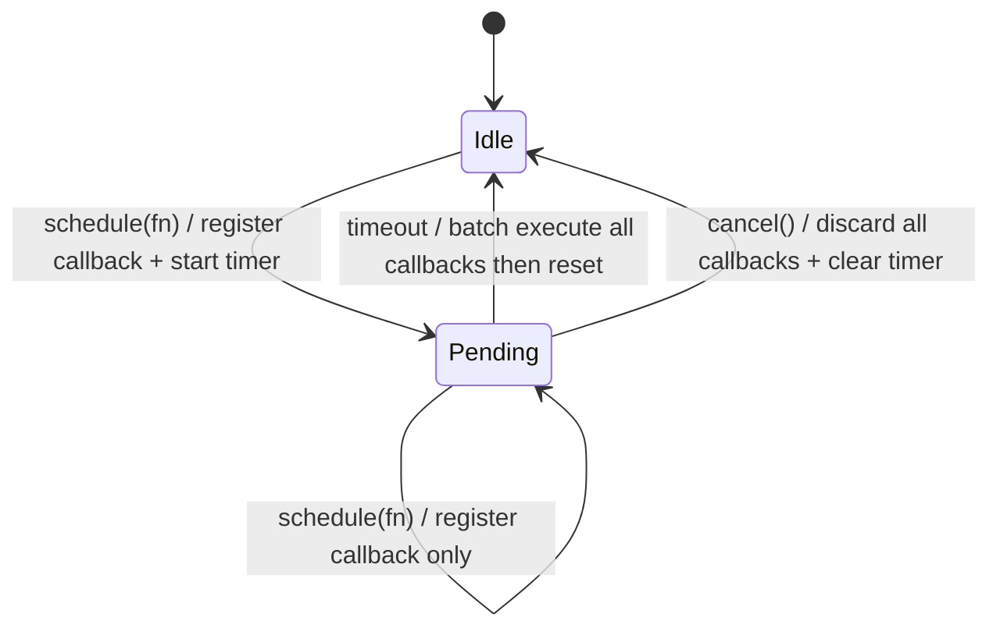

# AtomicTimerScheduler

A deferred scheduler that batches callbacks within a time window, with cancellation support.

## Requirement

- Support cancellation
- Batch execute deferred callbacks in the same time window

## State Machine



## API Reference

```ts
/**
 * A deferred scheduler that batches callbacks within a time window,
 * with cancellation support.
 *
 * State transitions:
 * - Idle → Pending: schedule(fn) — register callback + start timer
 * - Pending → Pending: schedule(fn) — register callback only (timer NOT reset)
 * - Pending → Idle: timeout — batch execute all callbacks, then reset
 * - Pending → Idle: cancel() — discard all callbacks + clear timer
 */
class AtomicTimerScheduler {
  /**
   * @param timeout — time window in milliseconds before batch execution, default `300`
   */
  constructor(timeout?: number);

  /**
   * Registers a callback to be executed after the time window expires.
   *
   * - Idle state: registers callback and starts the timer
   * - Pending state: registers callback only, does NOT reset the timer
   * - On timeout: all registered callbacks are executed synchronously in batch,
   *   then the scheduler resets to idle
   * - A throwing callback does NOT prevent subsequent callbacks from executing
   */
  schedule(fn: () => void): void;

  /**
   * Cancels all pending callbacks and clears the timer, returning to idle state.
   * No-op if already idle.
   */
  cancel(): void;
}
```
