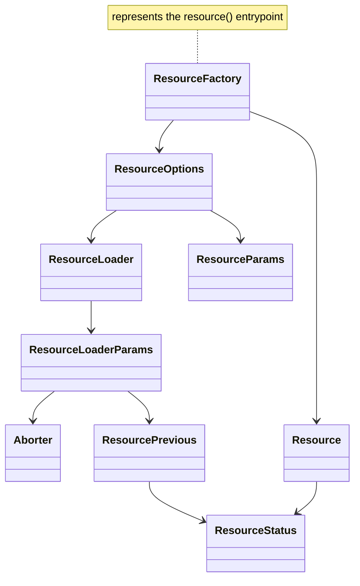
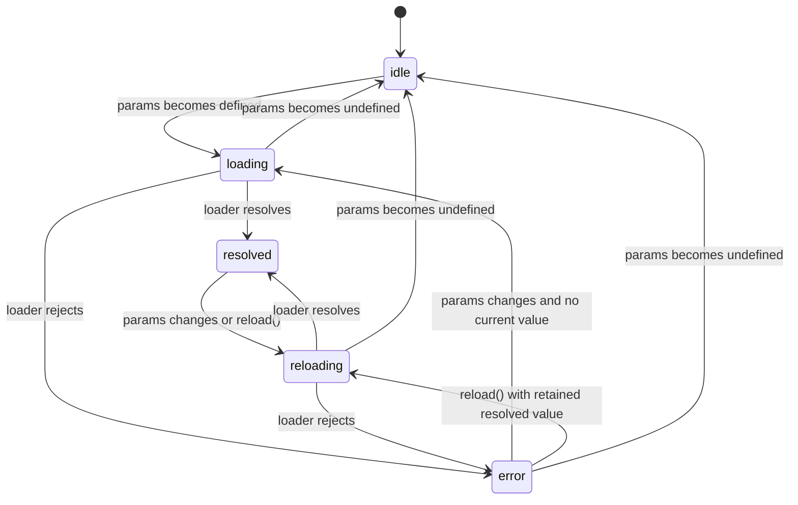

# @unsignal/core

## Goal

The `Resource` API provide a framework-agnostic `Resource` primitive for `@unsignal/core` that integrates with `@preact/signals-core`.

## Principles

- Only use `@preact/signals-core` public APIs (`signal` / `computed` / `effect` / `batch` / `untracked` / `peek` / `createModel`), **usage of non-public methods is strictly prohibited!**

## API Reference



### `ResourceStatus`

```ts
type ResourceStatus = 'idle' | 'loading' | 'reloading' | 'resolved' | 'error';
```



- `loading` means there is no retained value for the current resource instance
- `reloading` means a new run is active while the previous resolved value stays readable
- `error` may coexist with a retained value from an older successful run; consumers must read `value` and `error` independently
- Each `params` reevaluation is the entry point for deciding whether to abort, reset, or start a new loader run
- `params` becoming `undefined` aborts any active run, clears `error`, transitions to `idle`, and restores `value` to `defaultValue` or `undefined`
- `params` becoming defined aborts any active run, clears `error`, and starts a new loader run
- A new run uses `loading` when no retained value exists and `reloading` when a retained value exists
- A resolved active run commits `value`, clears `error`, and transitions to `resolved`
- A rejected active run commits `error` and transitions to `error`
- Only the latest active loader run may commit; any stale resolve or reject result is ignored completely
- Loader authors do not need to branch on aborted state; stale-run protection is owned by the `Resource` implementation

### `Aborter`

```ts
interface Aborter {
  // support modern cancelable API, e.g. fetch
  readonly signal: AbortSignal;
  // support legacy non-cancelable API, e.g. timers, sockets, or callback-based clients
  onAbort(cleanupFn: () => void): void;
}
```

**Annotations:**

- `Aborter` is designed for **Developer** to recycle physical resource
- `Aborter` never throws, if `onAbort(cleanupFn)` is called after the run is already aborted, the callback is ignored
- Loader authors never need to inspect aborted state, if cleanup is omitted or implemented incorrectly, `Resource` state still remains correct, only the external resource cleanup is affected

### `ResourcePrevious`

```ts
interface ResourcePrevious {
  readonly status: ResourceStatus;
}
```

### `ResourceLoaderParams`

```ts
interface ResourceLoaderParams<TParams> {
  readonly params: TParams;
  readonly aborter: Aborter;
  readonly previous: ResourcePrevious;
}
```

### `ResourceLoader`

```ts
type ResourceLoader<TParams, TValue> = (params: ResourceLoaderParams<TParams>) => Promise<TValue>;
```

### `Resource`

```ts
interface Resource<T> {
  readonly value: ReadonlySignal<T>;
  readonly status: ReadonlySignal<ResourceStatus>;
  readonly error: ReadonlySignal<unknown | undefined>;
  readonly isLoading: ReadonlySignal<boolean>;
  hasValue(this: T extends undefined ? this : never): this is Resource<Exclude<T, undefined>>;
  hasValue(): boolean;
  reload(): boolean;
  destroy(): void;
}
```

### `ResourceOptions`

```ts
type ResourceParams<TParams> = ReadonlySignal<TParams | undefined> | (() => TParams | undefined);

interface ResourceOptions<TParams, TValue> {
  params: ResourceParams<TParams>;
  loader: ResourceLoader<TParams, TValue>;
  defaultValue?: TValue;
}
```

- `defaultValue` establishes the initial retained value and is restored whenever `params` becomes `undefined`

### `Resource Factory`

```ts
function resource<TParams, TValue>(
  options: ResourceOptions<TParams, TValue> & { defaultValue: NoInfer<TValue> }
): Resource<TValue>;

function resource<TParams, TValue>(
  options: ResourceOptions<TParams, TValue>
): Resource<TValue | undefined>;
```

- Construction performs an immediate `params` evaluation under reactive tracking
- A defined `params` value starts a loader run immediately
- An `undefined` `params` value keeps the resource in `idle`

- `params` is reactive:
  - when it is a `ReadonlySignal`, the resource tracks `params.value`
  - when it is a getter function, the resource tracks signal reads inside the getter
- `value` is the single source of truth for whether a resource currently holds a value
- When `params` becomes `undefined`:
  - abort any running loader
  - clear `error`
  - set `status` to `idle`
  - set `value` to `defaultValue` when provided, otherwise `undefined`
- When `params` becomes defined:
  - abort any running loader
  - start a new loader run
  - use `loading` if there is no currently retained value
  - use `reloading` if a current value is retained
- `reload()`:
  - reruns the loader using the latest defined `params`
  - returns `false` when current `params` is `undefined`
  - otherwise aborts the current run, starts a new run, and returns `true`
- `destroy()`:
  - stops reactive tracking
  - aborts any running loader

### Usage Example

```ts
import { signal } from '@preact/signals-core';
import { resource } from '@unsignal/core';

interface User {
  id: number;
  name: string;
}

const userId = signal<number | undefined>(1);

const userResource = resource({
  params: () => userId.value,
  loader: async ({ params, aborter }) => {
    const response = await fetch(`/api/users/${params}`, {
      signal: aborter.signal,
    });
    const user: User = await response.json();

    return user;
  },
});
```

### Usage Example: Legacy Cancellation

```ts
import { signal } from '@preact/signals-core';
import { resource } from '@unsignal/core';

const query = signal<string | undefined>('hello');

const searchResource = resource({
  params: () => query.value?.trim(),
  defaultValue: [] as string[],
  loader: ({ params, aborter }) =>
    new Promise<string[]>((resolve) => {
      const timer = setTimeout(() => {
        resolve([params]);
      }, 300);

      aborter.onAbort(() => clearTimeout(timer));
    }),
});
```
